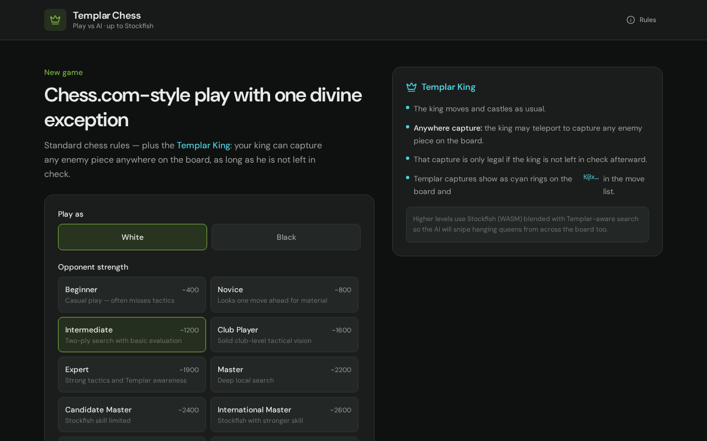
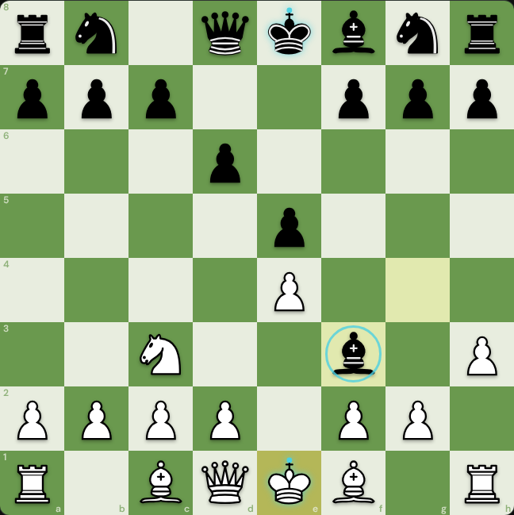
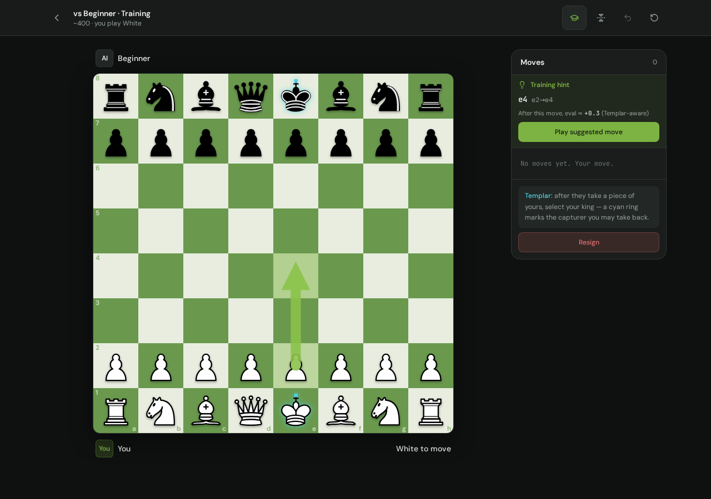
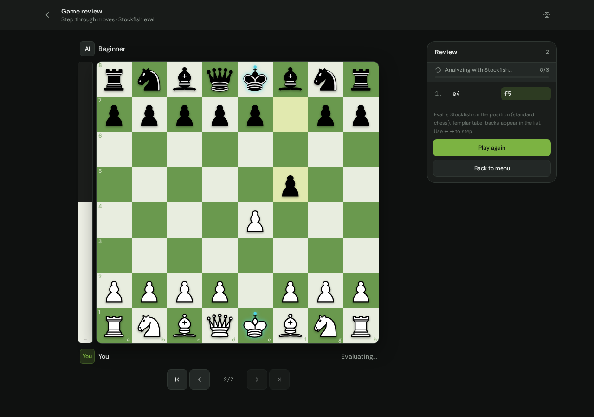
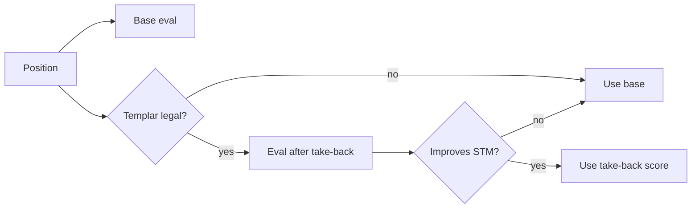

<div align="center">

# ♔ King’s Templar Chess

### Chess.com energy. One divine exception.

**Standard chess — until your piece falls.**  
Then the **Templar King** may take that capturer back from *anywhere* on the board.

<br/>

### ▶️ [Play now → kings-templar-chess.grok.me](http://kings-templar-chess.grok.me/)

<br/>

[](http://kings-templar-chess.grok.me/)
[](#stack)
[](#stack)
[](#stack)
[](#ai--engines)
[](#license)

<br/>

<p>
  <strong>Play vs AI</strong> · from beginner to full Stockfish<br/>
  <strong>Templar take-backs</strong> · training mode · post-game analysis
</p>



<p>
  <a href="http://kings-templar-chess.grok.me/"><strong>Open the live game</strong></a>
  · no install · runs in your browser
</p>

</div>

---

## The twist

> **Templar King rule**  
> When an enemy piece captures one of yours, **on your next move** your king may **teleport** to that capturer’s square and recapture it — from any distance — **if** doing so does not leave your king in check.

Everything else is classical chess: castling, en passant, promotion, stalemate, draws.

| Normal chess | Templar Chess |
| --- | --- |
| King steps one square | King steps one square **and** may take back |
| Recapture only if adjacent / legal | Recapture the **last capturer only**, anywhere |
| Engines ignore variant tactics | AI, training & analysis are **Templar-aware** |

<p align="center">
  
</p>

---

## Features

<table>
<tr>
<td width="50%" valign="top">

### ♟ Play
- Chess.com-style board & piece set  
- White or Black  
- **10 difficulty levels** (~400 → ~3200)  
- Captured pieces, material, undo, resign  
- Mobile-friendly layout  

</td>
<td width="50%" valign="top">

### ⚡ Templar engine
- Full rules + custom take-back legality  
- Cyan targets when a take-back is live  
- AI that **uses** (and defends against) the rule  
- Local minimax → Stockfish WASM hybrid  

</td>
</tr>
<tr>
<td width="50%" valign="top">

### 🎓 Training mode
- Instant local hint arrow  
- Mate-in-one never missed  
- Stockfish refine (~0.5–1s)  
- **Templar-aware** best-move search  
- One-click “Play suggested move”  

</td>
<td width="50%" valign="top">

### 📊 Game review
- Ply-by-ply navigation (← →)  
- Vertical eval bar (white from bottom)  
- Inaccuracy / mistake / blunder tags  
- Scores assume strong Templar take-backs  
- Missed take-backs flagged  

</td>
</tr>
</table>

<p align="center">
  
  &nbsp;
  
</p>

---

## Try it

| | |
| --- | --- |
| **Live game** | **[http://kings-templar-chess.grok.me/](http://kings-templar-chess.grok.me/)** |
| **Source** | [github.com/hilather/kings-templar-chess](https://github.com/hilather/kings-templar-chess) |

Open the live link in any modern browser — pick a difficulty, optionally enable training mode, and play.

---

## Quick start (local)

```bash
# clone
git clone https://github.com/hilather/kings-templar-chess.git
cd kings-templar-chess

# install & run (Node 20+)
npm install
npm run dev
# → http://localhost:8080
```

| Script | What it does |
| --- | --- |
| `npm run dev` | Dev server on `0.0.0.0:8080` |
| `npm run build` | Production / Vercel build |
| `npm run typecheck` | TypeScript strict check |
| `npm run preview` | Serve the production build |

---

## How to play

1. Pick **color** and **opponent strength**.  
2. Optional: turn on **Training mode** for live best-move arrows.  
3. Play — when they capture one of your pieces, select your **king**: a **cyan ring** marks the take-back target.  
4. After the game → **Analyze** for a Templar-aware Stockfish review.

### Difficulty ladder

| Level | ~Rating | Engine |
| --- | ---: | --- |
| Beginner → Club | 400–1600 | Local minimax |
| Expert → Master | 1900–2200 | Deeper minimax |
| CM → GM | 2400–2800 | Stockfish skill-limited |
| **Stockfish** | 3200 | Full-strength WASM |

---

## Architecture

```text
src/
├── components/chess/     # Board, pieces, eval bar, main Game shell
├── lib/chess/
│   ├── engine.ts         # TemplarChess — chess.js + take-back rule
│   ├── eval.ts           # Material + PST + Templar bonuses
│   ├── ai.ts             # Minimax + Stockfish hybrid opponents
│   ├── stockfish.ts      # Browser UCI worker (serialized queue)
│   ├── analysis.ts       # Post-game Templar-aware evaluation
│   ├── training.ts       # Fast best-move hints (local → SF refine)
│   └── types.ts          # Difficulties, moves, shared types
├── routes/               # TanStack Start entry
└── styles.css            # Design tokens (board, templar cyan, …)
public/stockfish/         # Stockfish lite single-thread WASM
```

### Templar-aware evaluation

Engines that only see FEN miss the variant. We fix that by:

1. Scoring the position with Stockfish (or local eval).  
2. If a **legal Templar recapture** exists for the side to move, scoring **after** that recapture.  
3. Keeping the score **better for the side to move**.

Used in **AI**, **training hints**, and **game review** so missed take-backs look like real mistakes.



---

## Stack

| Layer | Tech |
| --- | --- |
| UI | React 19, Tailwind v4, Radix / shadcn-style primitives |
| App | TanStack Start + Router + Query |
| Chess core | `chess.js` + custom `TemplarChess` |
| AI | Alpha-beta minimax · Stockfish 18 lite (WASM worker) |
| Build | Vite 8 · TypeScript · Nitro `vercel` preset |

---

## Project docs

| Doc | Contents |
| --- | --- |
| [docs/RULES.md](docs/RULES.md) | Precise Templar rule, edge cases, SAN notes |
| [docs/ENGINE.md](docs/ENGINE.md) | Move gen, AI levels, training pipeline |

---

## Contributing

Ideas welcome: opening books, puzzles mode, PGN import/export, multiplayer, stronger multi-PV training.

```bash
npm run typecheck
npm run build
```

Keep the **Templar rule** exact: recapture only the **immediate last capturer**, and never leave yourself in check.

---

## License

MIT — play freely, fork boldly, take back wisely.

---

<div align="center">

### [▶ Play King’s Templar Chess](http://kings-templar-chess.grok.me/)

**Built with Grok · powered by Stockfish · blessed by the Templar King**

[`hilather/kings-templar-chess`](https://github.com/hilather/kings-templar-chess)
·
[kings-templar-chess.grok.me](http://kings-templar-chess.grok.me/)

</div>
